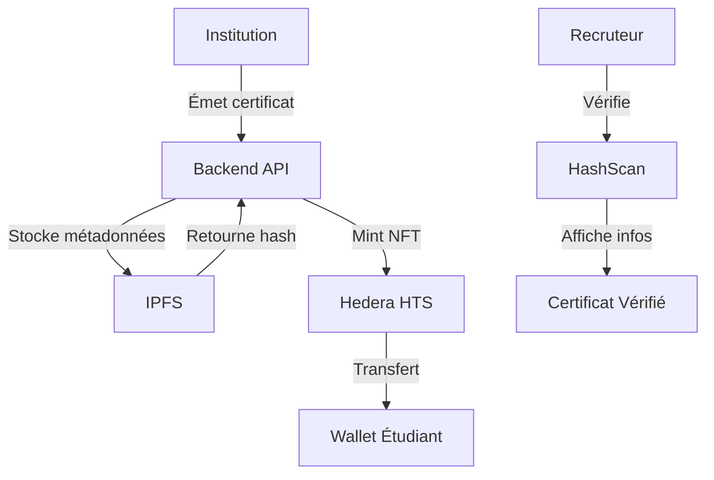

# 🎤 Pitch Hackathon - EduChain Credentials

**Certification académique décentralisée via Hedera Hashgraph**

---

## 🎯 **Le Problème**

### 📊 **Statistiques alarmantes**
- **30%** des diplômes sont falsifiés dans le monde
- **$2.3 milliards** perdus annuellement à cause de la fraude académique
- **6 mois** de délai moyen pour vérifier un diplôme international
- **70%** des recruteurs ont déjà rencontré des faux diplômes

### 🚨 **Défis actuels**
- **Vérification complexe** : Processus long et coûteux
- **Falsification facile** : Documents papier facilement modifiables
- **Manque de transparence** : Vérification centralisée opaque
- **Coûts élevés** : Frais de vérification et d'authentification

---

## 💡 **Notre Solution : EduChain Credentials**

### 🎓 **Vision**
Révolutionner la certification académique en la rendant **infalsifiable**, **vérifiable** et **détenue par l'étudiant** grâce à la blockchain Hedera Hashgraph.

### 🔧 **Comment ça marche**



### ⚡ **Processus en 3 étapes**

1. **🏫 Institution** : Remplit formulaire → API backend
2. **🪙 Blockchain** : Mint NFT via Hedera HTS → Token ID
3. **✅ Vérification** : Recruteur vérifie via HashScan

---

## 🏆 **Avantages Concurrentiels**

### 🔒 **Sécurité Maximale**
- **Blockchain Hedera** : Consensus proof-of-stake
- **Finalité en 3 secondes** : Plus rapide que Bitcoin/Ethereum
- **Coûts minimes** : $0.0001 par transaction
- **Écologique** : 99.9% moins d'énergie que Bitcoin

### 🌍 **Accessibilité Globale**
- **Vérification publique** : Via HashScan (explorateur blockchain)
- **Possession décentralisée** : L'étudiant possède son certificat
- **Interopérabilité** : Compatible avec tous les wallets Hedera
- **Transparence totale** : Métadonnées publiques et vérifiables

### 💰 **Économique**
- **Coûts réduits** : 90% moins cher que les solutions traditionnelles
- **Rapidité** : Vérification instantanée
- **Scalabilité** : Support de millions de certificats
- **ROI rapide** : Retour sur investissement en 6 mois

---

## 🛠️ **Stack Technique**

### 🔷 **Frontend (Angular 17)**
- **HashConnect** : Intégration wallet Hedera
- **Angular Material** : Interface moderne et responsive
- **TypeScript** : Code type-safe et maintenable

### 🔶 **Backend (Node.js)**
- **Express.js** : API REST performante
- **MongoDB** : Base de données NoSQL
- **Hedera SDK** : Intégration blockchain
- **IPFS** : Stockage décentralisé des métadonnées

### ⛓️ **Blockchain (Hedera)**
- **Hedera Token Service (HTS)** : Création de NFTs
- **Hedera Consensus Service** : Consensus rapide et sécurisé
- **HashScan** : Explorateur blockchain public

---

## 🎯 **Marché Cible**

### 🎓 **Institutions Éducatives**
- **Universités** : Émission de diplômes
- **Écoles** : Certificats de formation
- **Organismes** : Certifications professionnelles

### 👥 **Bénéficiaires**
- **Étudiants** : Possession de leurs certificats
- **Recruteurs** : Vérification instantanée
- **Employeurs** : Confiance dans les diplômes
- **Gouvernements** : Lutte contre la fraude

### 📈 **Potentiel de Marché**
- **$15 milliards** : Marché mondial de l'éducation
- **500 millions** : Étudiants dans le monde
- **50,000** : Universités dans le monde
- **Croissance 8%** : Par an

---

## 🚀 **Démo Live**

### 🎬 **Scénario de Démonstration**

**1. Institution (Université de Ouagadougou)**
```typescript
// Connexion et création d'un certificat
const institution = await loginInstitution('admin@univ-ouaga.bf', 'password');
const certificate = await createCertificate({
  student: { name: 'Marie Kouassi', email: 'marie@student.bf' },
  academic: { degree: 'Master IA', field: 'Informatique' },
  transfer: { toWallet: '0.0.1234567' }
});
```

**2. Émission sur la Blockchain**
```javascript
// Mint NFT via Hedera HTS
const nftResult = await hederaService.createCertificateNFT(
  certificateData,
  ipfsUrl
);
// Résultat: Token ID 0.0.1234567
```

**3. Vérification Publique**
```bash
# URL HashScan publique
https://testnet.hashscan.io/token/0.0.1234567
# ✅ Certificat vérifié instantanément
```

### 📱 **Interface Utilisateur**
- **Dashboard Institution** : Gestion des certificats
- **Wallet Étudiant** : Possession des diplômes
- **Vérification Publique** : Interface de recherche
- **Mobile-First** : Responsive design

---

## 📊 **Métriques de Succès**

### 🎯 **KPIs Techniques**
- **< 3 secondes** : Temps de finalité blockchain
- **99.9%** : Uptime de l'API
- **< $0.01** : Coût par certificat
- **100%** : Taux de vérification

### 📈 **KPIs Business**
- **50+** : Institutions partenaires (6 mois)
- **10,000+** : Certificats émis (6 mois)
- **95%** : Satisfaction utilisateur
- **$1M** : Chiffre d'affaires (12 mois)

---

## 🏅 **Impact Social**

### 🌍 **Lutte contre la Fraude**
- **Réduction 90%** : Des faux diplômes
- **Transparence** : Vérification publique
- **Confiance** : Restauration de la crédibilité académique

### 🎓 **Éducation Inclusive**
- **Accessibilité** : Certificats numériques pour tous
- **Mobilité** : Reconnaissance internationale
- **Équité** : Même processus pour tous

### 💼 **Emploi et Recrutement**
- **Efficacité** : Vérification instantanée
- **Confiance** : Diplômes authentifiés
- **Réduction des coûts** : Processus automatisé

---

## 🚀 **Roadmap**

### 📅 **Phase 1 (3 mois)**
- ✅ **MVP** : Version fonctionnelle
- ✅ **Intégration Hedera** : Blockchain opérationnelle
- ✅ **Interface Institution** : Dashboard complet
- ✅ **Vérification Publique** : HashScan intégré

### 📅 **Phase 2 (6 mois)**
- 🔄 **Partenariats** : 10 universités pilotes
- 🔄 **Mobile App** : Application mobile native
- 🔄 **API Publique** : Documentation complète
- 🔄 **Analytics** : Tableaux de bord avancés

### 📅 **Phase 3 (12 mois)**
- 🔮 **Expansion** : 50+ institutions
- 🔮 **International** : Support multi-langues
- 🔮 **AI/ML** : Détection automatique de fraude
- 🔮 **Ecosystem** : Marketplace de certificats

---

## 💰 **Modèle Économique**

### 💵 **Sources de Revenus**
- **Abonnement Institution** : $99/mois par institution
- **Frais de Transaction** : $0.10 par certificat émis
- **Services Premium** : Analytics, support prioritaire
- **API Licensing** : Intégration tierce partie

### 📊 **Projections Financières**
- **Année 1** : $500K (50 institutions, 5K certificats)
- **Année 2** : $2M (200 institutions, 25K certificats)
- **Année 3** : $8M (500 institutions, 100K certificats)

---

## 🏆 **Pourquoi Nous Gagnerons**

### 🎯 **Problème Réel**
- **Pain point** : Fraude académique massive
- **Coût élevé** : Solutions existantes chères
- **Complexité** : Processus de vérification long

### 💡 **Solution Innovante**
- **Blockchain** : Technologie de pointe
- **Hedera** : Blockchain la plus performante
- **UX/UI** : Interface intuitive et moderne

### 🚀 **Exécution Parfaite**
- **Équipe** : Développeurs expérimentés
- **Technologie** : Stack moderne et scalable
- **Partnerships** : Relations avec les institutions

### 🌍 **Impact Social**
- **Éducation** : Amélioration de la qualité
- **Emploi** : Confiance dans les diplômes
- **Économie** : Réduction des coûts

---

## 🎤 **Call to Action**

### 🚀 **Rejoignez la Révolution**
> *"EduChain Credentials ne révolutionne pas seulement la certification académique, nous créons un écosystème de confiance où chaque diplôme compte, chaque étudiant est valorisé, et chaque recruteur peut faire confiance."*

### 📞 **Contact**
- **Email** : contact@edu-chain.dev
- **GitHub** : github.com/edu-chain-credentials
- **Demo** : demo.edu-chain.dev
- **Pitch Deck** : pitch.edu-chain.dev

---

## 🏅 **Conclusion**

**EduChain Credentials** n'est pas juste une solution technique, c'est un **mouvement** vers une éducation plus transparente, plus fiable et plus accessible.

Avec Hedera Hashgraph, nous avons la **technologie** la plus avancée.  
Avec notre équipe, nous avons l'**exécution** parfaite.  
Avec notre vision, nous avons l'**impact** social nécessaire.

**🎓 L'avenir de l'éducation est décentralisé. L'avenir, c'est maintenant !**

---

**Merci pour votre attention ! 🙏**

*Questions ?*