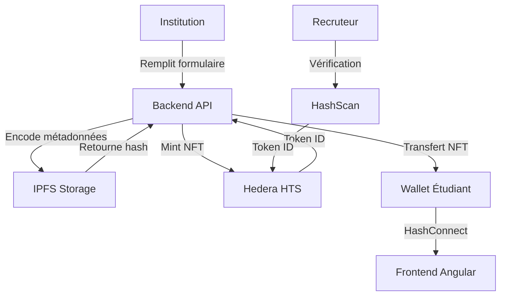

# 🎓 EduChain Credentials - Hashgraph Hackathon

**Une solution de certification académique décentralisée via Hedera Hashgraph**

[](https://hedera.com/)
[](https://angular.io/)
[](https://nodejs.org/)
[](https://ipfs.io/)
[](LICENSE)

## 🧠 **Résumé du projet**

**EduChain Credentials** révolutionne la certification académique en la rendant infalsifiable, vérifiable et détenue par l'étudiant. Grâce à Hedera Hashgraph et IPFS, chaque diplôme devient un NFT unique, consultable publiquement via HashScan.

### 🎯 **Objectifs**
- ✅ **Émission de certificats** par les institutions via NFTs
- ✅ **Possession décentralisée** par les étudiants dans leur wallet
- ✅ **Vérification publique** par les recruteurs via HashScan
- ✅ **Lutte contre la fraude** académique
- ✅ **Modernisation** du système éducatif

---

## 🏗️ **Architecture technique**

### 📁 Structure du projet

```
edu-chain-credentials/
├── frontend/                    # Application Angular
│   ├── src/app/
│   │   ├── pages/              # Home, Dashboard, Institution
│   │   ├── services/           # Hedera, IPFS, HashConnect
│   │   ├── models/             # Certificat, Utilisateur, Institution
│   │   └── components/         # Composants réutilisables
│   ├── package.json
│   └── angular.json
│
├── backend/                     # API Node.js + Express
│   ├── src/
│   │   ├── controllers/        # Logique métier
│   │   ├── routes/             # API REST
│   │   ├── services/           # Hedera SDK, IPFS
│   │   ├── models/             # Schémas de données
│   │   └── server.js           # Entrée serveur
│   └── package.json
│
├── smart-contracts/             # Contrats de gouvernance
│   ├── contracts/
│   └── scripts/
│
├── .env.example                 # Configuration d'environnement
├── docker-compose.yml           # Déploiement local
└── README.md                    # Documentation
```

---

## 🔗 **Flux fonctionnel**



### 🔄 **Étapes détaillées**

1. **🏫 Institution** : Se connecte et remplit un formulaire de certification
2. **⚙️ Backend** : Encode les métadonnées et les stocke sur IPFS
3. **🪙 Mint NFT** : Crée un NFT unique via Hedera HTS avec le hash IPFS
4. **📱 Transfert** : Envoie le NFT vers le wallet de l'étudiant via HashConnect
5. **✅ Vérification** : Le recruteur peut vérifier le certificat via HashScan

---

## 🚀 **Démarrage Rapide**

### 📋 **Prérequis**
- **Node.js** 18+
- **npm** 9+
- **Angular CLI** 17+
- **Wallet HashPack** (pour les tests)

### ⚡ **Installation Express**

```bash
# 1. Cloner le repository
git clone https://github.com/your-org/edu-chain-credentials.git
cd edu-chain-credentials

# 2. Configuration environnement
cp .env.example .env
# Éditer .env avec vos clés Hedera et IPFS

# 3. Backend - Installer et démarrer
cd backend
npm install
npm run dev

# 4. Frontend - Installer et démarrer (nouveau terminal)
cd ../frontend
npm install
npm start
```

### 🌐 **URLs de l'Application**
- **Frontend** : http://localhost:4200
- **Backend API** : http://localhost:3000
- **Health Check** : http://localhost:3000/health

---

## 🧪 **Démo technique**

### ✅ **Connexion HashConnect (Angular)**

```typescript
// frontend/src/app/services/hashconnect.service.ts
const hashconnect = new HashConnect();
const initData = await hashconnect.init({
  name: "EduChain Credentials",
  description: "Certifications académiques décentralisées",
  icon: "https://edu-chain.dev/icon.png",
  url: "https://edu-chain.dev"
});

// Connexion wallet
const pairingData = await hashconnect.openPairingModal();
```

### ✅ **API Mint NFT (Node.js)**

```javascript
// backend/src/services/hedera.service.js
const metadata = {
  name: "Benewende Pierre",
  degree: "Master Intelligence Artificielle",
  institution: "Université de Ouagadougou",
  date: "2025-01-13",
  gpa: "3.8/4.0",
  description: "Diplôme de Master en IA avec mention Très Bien"
};

const ipfsUrl = await ipfsService.uploadMetadata(metadata);
const tokenId = await hederaService.createNFT(
  "EduCert", 
  "EDU", 
  Buffer.from(ipfsUrl)
);
```

### ✅ **Vérification HashScan**

```typescript
// Vérification publique d'un certificat
const tokenId = "0.0.1234567";
const hashScanUrl = `https://hashscan.io/testnet/token/${tokenId}`;
// Le recruteur peut voir toutes les métadonnées publiquement
```

---

## 🎤 **Pitch de présentation**

> *"EduChain Credentials révolutionne la certification académique en la rendant infalsifiable, vérifiable et détenue par l'étudiant. Grâce à Hedera Hashgraph et IPFS, chaque diplôme devient un NFT unique, consultable publiquement. C'est une solution simple, rapide et sécurisée pour lutter contre la fraude et moderniser l'éducation."*

### 🏆 **Avantages concurrentiels**
- **🔒 Sécurité maximale** : Blockchain Hedera (3 secondes de finalité)
- **💰 Coûts réduits** : Frais de transaction minimes
- **🌍 Écologique** : Consensus proof-of-stake
- **🔍 Transparence** : Vérification publique via HashScan
- **📱 Accessibilité** : Interface intuitive pour tous

---

## 📚 **Documentation API**

### 🔐 **Authentification Institution**

```bash
# Login Institution
POST http://localhost:3000/api/auth/institution/login
Content-Type: application/json

{
  "email": "admin@univ-ouaga.bf",
  "password": "securePassword123"
}
```

### 🎓 **Émission de Certificat**

```bash
# Créer un certificat
POST http://localhost:3000/api/certificates/create
Authorization: Bearer <institution-token>
Content-Type: application/json

{
  "studentName": "Benewende Pierre",
  "studentEmail": "benewende@student.bf",
  "degree": "Master Intelligence Artificielle",
  "institution": "Université de Ouagadougou",
  "graduationDate": "2025-01-13",
  "gpa": "3.8",
  "description": "Diplôme avec mention Très Bien"
}
```

### 🔍 **Vérification Certificat**

```bash
# Vérifier un certificat
GET http://localhost:3000/api/certificates/verify/0.0.1234567
```

---

## 🛠️ **Technologies utilisées**

### 🔷 **Frontend (Angular)**
- **Angular 17+** : Framework principal
- **Angular Material** : Composants UI
- **HashConnect** : Intégration wallet Hedera
- **RxJS** : Gestion des observables
- **TypeScript** : Langage de développement

### 🔶 **Backend (Node.js)**
- **Express.js** : Framework web
- **Hedera SDK** : Intégration blockchain
- **IPFS** : Stockage décentralisé
- **MongoDB** : Base de données
- **JWT** : Authentification

### ⛓️ **Blockchain (Hedera)**
- **Hedera Token Service (HTS)** : Création de NFTs
- **Hedera Consensus Service** : Consensus
- **HashConnect** : Connexion wallet
- **HashScan** : Explorateur blockchain

---

## 🚢 **Déploiement**

### 🐳 **Docker Compose (Recommandé)**

```bash
# Démarrage complet
docker-compose up -d

# Vérification des services
docker-compose ps
```

### ☁️ **Déploiement Cloud**

```bash
# Frontend (Vercel)
cd frontend
npm run build
npx vercel --prod

# Backend (Railway)
cd backend
npm run deploy
```

---

## 🧪 **Tests**

```bash
# Tests Frontend
cd frontend
npm test
npm run e2e

# Tests Backend
cd backend
npm test
npm run test:coverage
```

---

## 🤝 **Contribution**

1. Fork le projet
2. Créer une branche feature (`git checkout -b feature/AmazingFeature`)
3. Commit vos changements (`git commit -m 'Add some AmazingFeature'`)
4. Push vers la branche (`git push origin feature/AmazingFeature`)
5. Ouvrir une Pull Request

---

## 📄 **Licence**

Ce projet est sous licence MIT. Voir [LICENSE](LICENSE) pour plus de détails.

---

## 🙏 **Remerciements**

- **Hedera Hashgraph** pour la blockchain
- **IPFS** pour le stockage décentralisé
- **Angular** pour le framework frontend
- **Node.js** pour le backend

---

## 📞 **Support**

- 📧 **Email** : support@edu-chain.dev
- 💬 **Discord** : [EduChain Community](https://discord.gg/edu-chain)
- 🐛 **Issues** : [GitHub Issues](https://github.com/your-org/edu-chain-credentials/issues)

---

**🎓 Prêt à révolutionner l'éducation avec la blockchain !**