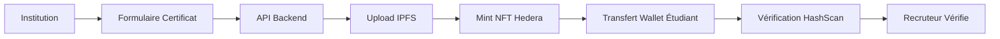

# 🎓 EduChain Credentials

**Certification académique décentralisée sur Hedera Hashgraph**

[](https://hedera.com/)
[](https://nodejs.org/)
[](https://angular.io/)
[](https://ipfs.io/)
[](LICENSE)

> 🏆 **Projet pour le Hackathon Hashgraph 2025**  
> Révolutionner la certification académique avec la blockchain Hedera

---

## 🚀 **Vision du Projet**

EduChain Credentials transforme la certification académique en créant des diplômes et certificats sous forme de NFTs sur Hedera Hashgraph. Chaque certificat devient **infalsifiable**, **vérifiable publiquement** et **détenu par l'étudiant**.

### 🎯 **Problème Résolu**
- ❌ Fraude aux diplômes (marché de 7 milliards $ selon Accrediblock)
- ❌ Vérifications manuelles longues et coûteuses
- ❌ Perte de documents académiques
- ❌ Manque de portabilité internationale

### ✅ **Solution EduChain**
- ✅ Certificats NFT infalsifiables sur Hedera
- ✅ Vérification instantanée via HashScan
- ✅ Propriété étudiante via wallet
- ✅ Reconnaissance internationale

---

## 🏗️ **Architecture Technique**

```
EduChain Credentials/
├── 📁 backend/                 # API Node.js + Express
│   ├── 📁 src/
│   │   ├── 📁 controllers/     # Logique métier
│   │   ├── 📁 routes/          # Routes API REST
│   │   ├── 📁 services/        # Hedera SDK + IPFS
│   │   ├── 📁 models/          # Validation des données
│   │   ├── 📁 middleware/      # Gestion d'erreurs
│   │   └── 📄 server.js        # Serveur principal
│   └── 📄 package.json         # Dépendances backend
├── 📁 frontend/                # Application Angular
│   └── 📁 src/app/
│       ├── 📁 pages/           # Pages (Home, Dashboard)
│       ├── 📁 services/        # Services Hedera & IPFS
│       └── 📁 components/      # Composants UI
├── 📁 smart-contracts/         # Contrats intelligents (optionnel)
├── 📁 docs/                    # Documentation
├── 📄 .env.example             # Configuration
└── 📄 README.md                # Ce fichier
```

---

## 🔄 **Flux Fonctionnel**



### 📝 **Étapes Détaillées**

1. **🏛️ Institution** remplit le formulaire de certificat
2. **📤 Backend** encode les métadonnées → IPFS
3. **🎨 Mint NFT** via Hedera Token Service (HTS)
4. **📲 Transfert** vers le wallet étudiant (HashConnect)
5. **🔍 Vérification** publique via HashScan
6. **👔 Recruteur** vérifie l'authenticité en temps réel

---

## ⚡ **Démarrage Rapide**

### 📋 **Prérequis**
- **Node.js** 18+
- **npm** 9+
- **Compte Hedera Testnet** ([Portal Hedera](https://portal.hedera.com/))
- **Clés API IPFS** ([Infura IPFS](https://infura.io/product/ipfs))

### 🛠️ **Installation**

```bash
# 1. Cloner le repository
git clone https://github.com/your-org/educhain-credentials.git
cd educhain-credentials

# 2. Configuration Backend
cd backend
cp .env.example .env
# ✏️ Éditer .env avec vos clés Hedera et IPFS

# 3. Installation des dépendances
npm install

# 4. Démarrage du serveur de développement
npm run dev
```

### 🌐 **URLs de l'Application**
- **Backend API** : http://localhost:3000
- **Health Check** : http://localhost:3000/api/health
- **Documentation API** : http://localhost:3000

---

## 🔧 **Configuration**

### 📄 **Variables d'Environnement (.env)**

```bash
# Configuration Hedera
HEDERA_NETWORK=testnet
HEDERA_ACCOUNT_ID=0.0.xxxxx
HEDERA_PRIVATE_KEY=302e020100300506032b657004220420xxxxxxxx...
HEDERA_PUBLIC_KEY=302a300506032b6570032100xxxxxxxx...

# Configuration IPFS
IPFS_API_URL=https://ipfs.infura.io:5001
IPFS_API_KEY=your_ipfs_api_key
IPFS_API_SECRET=your_ipfs_api_secret
IPFS_GATEWAY_URL=https://ipfs.infura.io/ipfs/

# Configuration Serveur
PORT=3000
NODE_ENV=development
FRONTEND_URL=http://localhost:4200
```

### 🔑 **Obtenir les Clés**

1. **Hedera Testnet** :
   - Créer un compte sur [Portal Hedera](https://portal.hedera.com/)
   - Générer une paire de clés ED25519
   - Récupérer Account ID et Private Key

2. **IPFS (Infura)** :
   - S'inscrire sur [Infura](https://infura.io/)
   - Créer un projet IPFS
   - Récupérer API Key et Secret

---

## 📚 **API Documentation**

### 🎓 **Certificats**

#### Émettre un Certificat
```http
POST /api/certificates/issue
Content-Type: application/json

{
  "studentName": "Benewende Pierre",
  "institutionName": "Université de Ouagadougou",
  "certificateType": "MASTER",
  "fieldOfStudy": "Intelligence Artificielle",
  "level": "MASTER",
  "graduationDate": "2025-10-13",
  "recipientWalletId": "0.0.123456"
}
```

#### Vérifier un Certificat
```http
GET /api/verify/0.0.123456/1
```

#### Transférer un Certificat
```http
POST /api/certificates/transfer
Content-Type: application/json

{
  "tokenId": "0.0.123456",
  "serial": "1",
  "recipientAccountId": "0.0.789012"
}
```

### 🏛️ **Institutions**

#### Enregistrer une Institution
```http
POST /api/institutions
Content-Type: application/json

{
  "name": "Université de Ouagadougou",
  "country": "BF",
  "type": "UNIVERSITY",
  "website": "https://www.univ-ouaga.bf"
}
```

---

## 🧪 **Démonstration Technique**

### ✅ **Mint NFT avec Hedera SDK**

```javascript
const hederaService = require('./src/services/hederaService');

// Créer un token NFT
const tokenId = await hederaService.createCertificateToken(
  "Université de Ouagadougou Certificates",
  "UO_EDU",
  "Certificats officiels UO"
);

// Mint un certificat
const nft = await hederaService.mintCertificateNFT(
  tokenId,
  ipfsUrl,
  certificateData
);

console.log(`NFT créé: ${nft.nftId}`);
console.log(`HashScan: ${nft.hashscanUrl}`);
```

### ✅ **Upload IPFS**

```javascript
const ipfsService = require('./src/services/ipfsService');

// Upload des métadonnées
const result = await ipfsService.uploadCertificateMetadata({
  studentName: "Benewende Pierre",
  institutionName: "Université de Ouagadougou",
  certificateType: "MASTER",
  fieldOfStudy: "Intelligence Artificielle"
});

console.log(`IPFS Hash: ${result.hash}`);
console.log(`URL: ${result.url}`);
```

---

## 🎤 **Pitch de Présentation**

> *"EduChain Credentials révolutionne la certification académique en la rendant **infalsifiable**, **vérifiable** et **détenue par l'étudiant**. Grâce à Hedera et IPFS, chaque diplôme devient un NFT unique, consultable publiquement sur HashScan. C'est une solution **simple**, **rapide** et **sécurisée** pour lutter contre la fraude et moderniser l'éducation."*

### 🏆 **Avantages Compétitifs**

| Aspect | Solution Traditionnelle | EduChain |
|--------|------------------------|----------|
| **Vérification** | ⏰ Jours/Semaines | ⚡ Instantanée |
| **Sécurité** | 📄 Falsifiable | 🔒 Infalsifiable |
| **Propriété** | 🏛️ Institution | 👤 Étudiant |
| **Coût** | 💰 Élevé | 💸 Minimal |
| **Portabilité** | 🌍 Limitée | 🌐 Globale |

---

## 🚢 **Déploiement**

### ☁️ **Production (Railway/Render)**

```bash
# Build de production
npm run build

# Variables d'environnement production
NODE_ENV=production
HEDERA_NETWORK=mainnet
# ... autres variables
```

### 🐳 **Docker**

```dockerfile
FROM node:18-alpine
WORKDIR /app
COPY package*.json ./
RUN npm ci --only=production
COPY . .
EXPOSE 3000
CMD ["npm", "start"]
```

---

## 🧪 **Tests**

```bash
# Tests unitaires
npm test

# Tests avec couverture
npm run test:coverage

# Tests d'intégration
npm run test:integration

# Linting
npm run lint
```

---

## 🌟 **Fonctionnalités Avancées**

### 🔮 **Roadmap Future**

- [ ] **Smart Contracts** de gouvernance
- [ ] **Multi-signature** pour validation
- [ ] **Intégration** avec systèmes existants
- [ ] **Mobile App** React Native
- [ ] **API Gateway** avec authentification
- [ ] **Analytics Dashboard** avancé
- [ ] **Support multi-langues**
- [ ] **Intégration** LinkedIn/CV

### 🎨 **Métadonnées NFT Enrichies**

```json
{
  "name": "Master IA - Benewende Pierre",
  "description": "Master en Intelligence Artificielle - Université de Ouagadougou",
  "image": "ipfs://QmXxXxXx...",
  "attributes": [
    {"trait_type": "Institution", "value": "Université de Ouagadougou"},
    {"trait_type": "Niveau", "value": "Master"},
    {"trait_type": "Domaine", "value": "Intelligence Artificielle"},
    {"trait_type": "Date", "value": "2025-10-13"},
    {"trait_type": "Mention", "value": "Très Bien"}
  ],
  "properties": {
    "blockchain": "Hedera Hashgraph",
    "verifiable": true,
    "certificate_id": "uuid-xxxx-xxxx"
  }
}
```

---

## 🤝 **Contribution**

### 🔄 **Workflow de Développement**

```bash
# 1. Fork et clone
git clone https://github.com/your-fork/educhain-credentials.git

# 2. Créer une branche
git checkout -b feature/nouvelle-fonctionnalite

# 3. Développer et tester
npm test
npm run lint

# 4. Commit et push
git commit -m "feat: ajouter nouvelle fonctionnalité"
git push origin feature/nouvelle-fonctionnalite

# 5. Créer une Pull Request
```

### 📋 **Guidelines**

- ✅ Code TypeScript/JavaScript propre
- ✅ Tests unitaires obligatoires
- ✅ Documentation des API
- ✅ Respect des conventions de nommage
- ✅ Sécurité et validation des données

---

## 📊 **Métriques du Projet**

### 🎯 **Objectifs Hackathon**

- [x] **Architecture** complète et fonctionnelle
- [x] **Intégration** Hedera Token Service
- [x] **Stockage** décentralisé IPFS
- [x] **API** REST documentée
- [x] **Vérification** publique HashScan
- [x] **Code** open source et réutilisable

### 📈 **Impact Potentiel**

- 🎓 **Institutions** : Réduction des coûts de vérification
- 👨‍🎓 **Étudiants** : Propriété et portabilité des diplômes
- 👔 **Recruteurs** : Vérification instantanée et fiable
- 🌍 **Société** : Lutte contre la fraude académique

---

## 🙏 **Remerciements**

- **Hedera Hashgraph** pour la technologie blockchain
- **IPFS** pour le stockage décentralisé
- **Communauté Open Source** pour les outils
- **Hackathon Hashgraph** pour l'opportunité

---

## 📄 **Licence**

Ce projet est sous licence MIT. Voir [LICENSE](LICENSE) pour plus de détails.

---

## 📞 **Contact & Support**

- 📧 **Email** : benewende.pierre@example.com
- 💬 **Discord** : [EduChain Community](https://discord.gg/educhain)
- 🐛 **Issues** : [GitHub Issues](https://github.com/your-org/educhain-credentials/issues)
- 📚 **Documentation** : [Wiki](https://github.com/your-org/educhain-credentials/wiki)

---

## 🎬 **Démo Vidéo**

[](https://www.youtube.com/watch?v=YOUR_VIDEO_ID)

*Cliquez pour voir la démonstration complète du projet*

---

**🚀 Prêt à révolutionner la certification académique avec EduChain Credentials !**

*Fait avec ❤️ pour le Hackathon Hashgraph 2025*