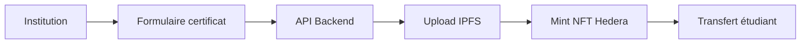
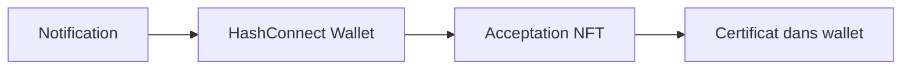
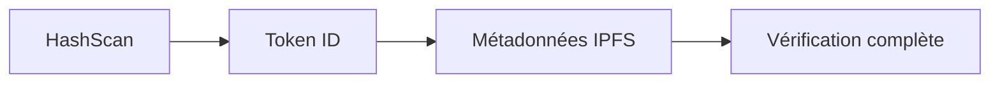

# 🎓 EduChain Credentials

**Certification académique décentralisée sur Hedera Hashgraph**

[](https://hedera.com/)
[](https://angular.io/)
[](https://nodejs.org/)
[](https://ipfs.io/)
[](LICENSE)

---

## 🧠 **Vue d'ensemble**

**EduChain Credentials** révolutionne la certification académique en la rendant **infalsifiable**, **vérifiable** et **détenue par l'étudiant**. Grâce à Hedera Hashgraph et IPFS, chaque diplôme devient un NFT unique, consultable publiquement sur HashScan.

### 🎯 **Problème résolu**
- ❌ **Fraude académique** : Certificats falsifiés
- ❌ **Vérification complexe** : Processus manuel long
- ❌ **Perte de documents** : Certificats physiques perdus
- ❌ **Centralisation** : Dépendance aux institutions

### ✅ **Solution proposée**
- ✅ **NFTs infalsifiables** sur Hedera HTS
- ✅ **Vérification instantanée** via HashScan
- ✅ **Stockage décentralisé** sur IPFS
- ✅ **Possession étudiante** via wallet HashConnect

---

## 🏗️ **Architecture technique**

```
edu-chain-credentials/
├── 📁 frontend/                 # Application Angular
│   ├── 📁 src/app/
│   │   ├── 📁 pages/           # Home, Dashboard, Institution
│   │   ├── 📁 services/        # Hedera, IPFS, API
│   │   ├── 📁 models/          # Certificat, Utilisateur
│   │   └── 📁 components/      # Composants réutilisables
│   └── 📄 package.json
│
├── 📁 backend/                  # API Node.js + Express
│   ├── 📁 src/
│   │   ├── 📁 controllers/     # Logique métier
│   │   ├── 📁 routes/          # API REST
│   │   ├── 📁 services/        # Hedera SDK, IPFS
│   │   └── 📄 server.js        # Entrée serveur
│   └── 📄 package.json
│
├── 📁 smart-contracts/          # Contrats Hedera (optionnel)
│   └── 📁 contracts/           # Gouvernance, vérification
│
├── 📁 docs/                     # Documentation
│   ├── 📁 api/                 # Documentation API
│   ├── 📁 deployment/          # Guide de déploiement
│   └── 📁 user-guide/          # Guide utilisateur
│
├── 📁 assets/                   # Ressources
│   ├── 📁 images/              # Screenshots, logos
│   ├── 📁 certificates/        # Exemples de certificats
│   └── 📁 icons/               # Icônes de l'application
│
├── 📄 .env.example             # Variables d'environnement
├── 📄 docker-compose.yml       # Déploiement local
└── 📄 README.md               # Ce fichier
```

---

## 🔗 **Flux fonctionnel**

### 1. **Institution** émet un certificat


### 2. **Étudiant** reçoit le certificat


### 3. **Recruteur** vérifie le certificat


---

## 🚀 **Démarrage rapide**

### 📋 **Prérequis**
- **Node.js** 18+
- **npm** 9+
- **Angular CLI** 17+
- **Compte Hedera** (testnet)
- **Wallet HashConnect** (HashPack)

### ⚡ **Installation**

```bash
# 1. Cloner le repository
git clone https://github.com/your-org/edu-chain-credentials.git
cd edu-chain-credentials

# 2. Backend - Installer et démarrer
cd backend
npm install
cp .env.example .env
# Configurer les variables d'environnement
npm run dev

# 3. Frontend - Installer et démarrer (nouveau terminal)
cd ../frontend
npm install
cp src/environments/environment.example.ts src/environments/environment.ts
# Configurer l'URL de l'API
npm start
```

### 🌐 **URLs de l'Application**
- **Frontend** : http://localhost:4200
- **Backend API** : http://localhost:3000
- **API Docs** : http://localhost:3000/api-docs

---

## 🧪 **Démo technique**

### ✅ **Connexion HashConnect (Angular)**
```typescript
const hashconnect = new HashConnect();
const initData = await hashconnect.init({
  name: "EduChain Credentials",
  description: "Certifications académiques décentralisées",
  icon: "https://edu-chain.dev/icon.png",
  url: "https://edu-chain.dev"
});

// Connexion wallet
const connectData = await hashconnect.connectToLocalWallet();
```

### ✅ **API Mint NFT (Node.js)**
```javascript
const metadata = {
  name: "Benewende Pierre",
  degree: "Master Intelligence Artificielle",
  institution: "Université de Ouagadougou",
  date: "2025-01-13",
  gpa: "3.8/4.0",
  skills: ["Machine Learning", "Deep Learning", "Python"]
};

// Upload sur IPFS
const ipfsUrl = await ipfsService.uploadMetadata(metadata);

// Créer NFT sur Hedera
const tokenId = await hederaService.createNFT(
  "EduCert", 
  "EDU", 
  Buffer.from(ipfsUrl)
);
```

### ✅ **Vérification HashScan**
```typescript
// URL de vérification publique
const hashscanUrl = `https://hashscan.io/testnet/token/${tokenId}`;

// Métadonnées IPFS
const metadata = await fetch(ipfsUrl).then(r => r.json());
```

---

## 🎤 **Pitch de présentation**

> *"EduChain Credentials révolutionne la certification académique en la rendant infalsifiable, vérifiable et détenue par l'étudiant. Grâce à Hedera Hashgraph et IPFS, chaque diplôme devient un NFT unique, consultable publiquement. C'est une solution simple, rapide et sécurisée pour lutter contre la fraude et moderniser l'éducation."*

### 🏆 **Avantages concurrentiels**
- **⚡ Rapidité** : Vérification instantanée
- **🔒 Sécurité** : Blockchain infalsifiable
- **🌍 Accessibilité** : Vérification mondiale
- **💰 Coût** : Frais Hedera minimes
- **🔄 Interopérabilité** : Standard NFT universel

---

## 📊 **Métriques de succès**

### 🎯 **Objectifs du hackathon**
- [ ] **Démo fonctionnelle** complète
- [ ] **Intégration Hedera** HTS + IPFS
- [ ] **Interface utilisateur** moderne
- [ ] **Documentation** technique complète
- [ ] **Pitch** convaincant (3 min)

### 📈 **Métriques techniques**
- **Temps de mint** : < 30 secondes
- **Coût par certificat** : < $0.01
- **Vérification** : Instantanée
- **Uptime** : 99.9%

---

## 🔧 **Configuration**

### 🔷 **Frontend (.env)**
```typescript
// frontend/src/environments/environment.ts
export const environment = {
  production: false,
  apiUrl: 'http://localhost:3000/api',
  hederaNetwork: 'testnet',
  hashconnectProjectId: 'your-project-id',
  ipfsGateway: 'https://ipfs.io/ipfs/'
};
```

### 🔶 **Backend (.env)**
```bash
# backend/.env
PORT=3000
NODE_ENV=development
FRONTEND_URL=http://localhost:4200

# Hedera Configuration
HEDERA_ACCOUNT_ID=0.0.123456
HEDERA_PRIVATE_KEY=your-private-key
HEDERA_NETWORK=testnet

# IPFS Configuration
IPFS_GATEWAY=https://ipfs.io/ipfs/
IPFS_API_URL=https://api.pinata.cloud

# JWT Configuration
JWT_SECRET=your-super-secure-secret
JWT_EXPIRES_IN=24h
```

---

## 🚢 **Déploiement**

### ☁️ **Production (Vercel + Railway)**
```bash
# Frontend sur Vercel
cd frontend
npm run build:prod
npx vercel --prod

# Backend sur Railway
cd backend
npm run deploy
```

### 🐳 **Docker Compose**
```yaml
version: '3.8'
services:
  frontend:
    build: ./frontend
    ports:
      - "4200:4200"
    environment:
      - API_URL=http://backend:3000/api
  
  backend:
    build: ./backend
    ports:
      - "3000:3000"
    environment:
      - HEDERA_ACCOUNT_ID=${HEDERA_ACCOUNT_ID}
      - HEDERA_PRIVATE_KEY=${HEDERA_PRIVATE_KEY}
```

---

## 📚 **Documentation API**

### 🔐 **Authentification**
```bash
# Login institution
POST /api/auth/institution/login
{
  "email": "institution@university.edu",
  "password": "securePassword"
}

# Login étudiant
POST /api/auth/student/login
{
  "walletAddress": "0x1234...",
  "signature": "0xabcd..."
}
```

### 🎓 **Certificats**
```bash
# Créer certificat
POST /api/certificates
Authorization: Bearer <institution-token>
{
  "studentName": "Benewende Pierre",
  "degree": "Master IA",
  "institution": "Université de Ouagadougou",
  "date": "2025-01-13",
  "gpa": "3.8/4.0"
}

# Vérifier certificat
GET /api/certificates/verify/{tokenId}
```

---

## 🧪 **Tests**

### 🔷 **Tests Frontend**
```bash
cd frontend
npm test                    # Tests unitaires
npm run test:coverage      # Couverture de code
npm run e2e               # Tests end-to-end
```

### 🔶 **Tests Backend**
```bash
cd backend
npm test                   # Tests unitaires
npm run test:integration  # Tests d'intégration
npm run test:coverage     # Couverture de code
```

---

## 🤝 **Contribution**

### 🔷 **Contribuer au Frontend**
```bash
cd frontend
git checkout -b feature/frontend-feature
# Faire vos modifications
npm run lint
npm test
git commit -m "feat(frontend): add new component"
```

### 🔶 **Contribuer au Backend**
```bash
cd backend
git checkout -b feature/backend-feature
# Faire vos modifications
npm run lint
npm test
git commit -m "feat(backend): add new endpoint"
```

---

## 📄 **Licence**

Ce projet est sous licence MIT. Voir [LICENSE](LICENSE) pour plus de détails.

---

## 🙏 **Remerciements**

- **Hedera Hashgraph** pour la blockchain performante
- **IPFS** pour le stockage décentralisé
- **Angular** pour le framework frontend
- **Node.js** pour le backend robuste

---

## 📞 **Support**

- 📧 **Email** : support@edu-chain.dev
- 💬 **Discord** : [EduChain Community](https://discord.gg/edu-chain)
- 🐛 **Issues** : [GitHub Issues](https://github.com/your-org/edu-chain-credentials/issues)
- 📖 **Docs** : [Documentation complète](https://docs.edu-chain.dev)

---

**🎓 Prêt à révolutionner l'éducation avec la blockchain !**

*Développé avec ❤️ pour le hackathon Hashgraph 2025*